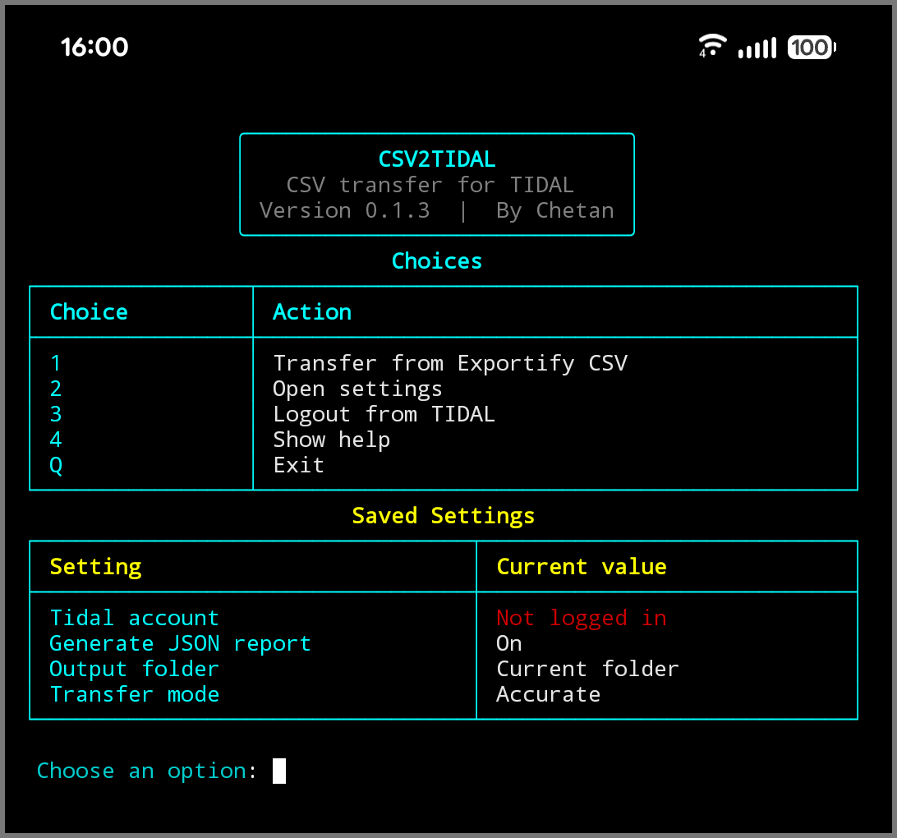
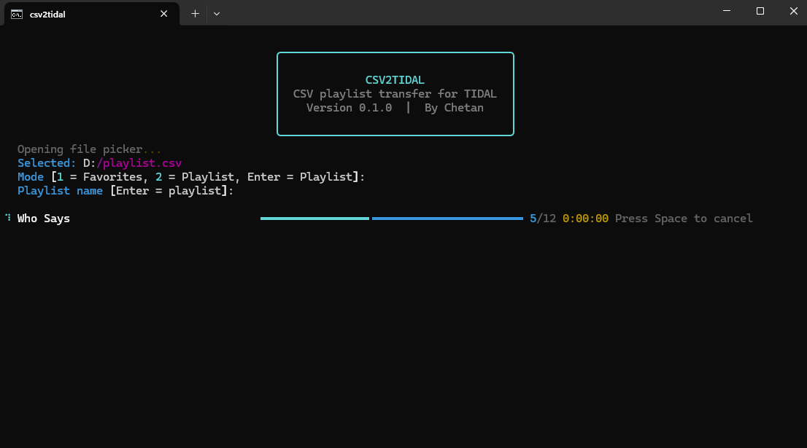

<p align="center">
  
</p>

<p align="center">
  
  
</p>

<p align="center"><strong>v0.1.3 - BETA</strong></p>

<h1 align="center">csv2tidal - Advanced Library Integration Tool</h1>

<p><strong>csv2tidal</strong> is a desktop CLI application for transferring Exportify CSV playlists to TIDAL with smarter, release-aware matching.</p>

<p>It is built to reduce incorrect album, compilation, and version matches so transferred tracks land on the most accurate TIDAL release possible.</p>

---

## ❔ Why csv2tidal when other tools already exist?

Most transfer tools can match the correct song but still attach the wrong album, compilation release, cover art, or edition. That is the exact problem `csv2tidal` is designed to reduce.

This project gives stronger weight to:

- track title
- artist name
- album name
- ISRC
- release context
- version differences like acoustic, remix, live, deluxe, and compilation releases

So when a track exists on multiple TIDAL releases, `csv2tidal` tries to choose the most accurate one instead of blindly accepting the first result.

## Preview

### CLI Demo

<p align="center">
  
</p>

### Results Table

<p align="center">
  
</p>

## ✨ Features

- Menu-driven interface
- Import Exportify CSV files directly
- Windows file picker support
- Transfer to TIDAL favorites
- Transfer to a new TIDAL playlist
- Smart duplicate handling for multiple TIDAL release entries
- Fast and Accurate matching modes
- Optional JSON report output
- Quiet `Ctrl+C` handling
- Press `Space` to cancel matching while a transfer is running

## 📄 Requirements

Before using `csv2tidal`, you need:

- Python 3.9 or newer
- a TIDAL account
- a playlist CSV exported from [Exportify](https://exportify.app/)

## Matching Logic

`csv2tidal` does not rely on a single field.

It compares a combination of:

- ISRC
- title
- artist
- album
- year
- duration

It also penalizes bad matches such as:

- compilations
- karaoke releases
- acoustic versions
- remix versions
- live versions
- deluxe or repackage mismatches

> [!NOTE]
> This helps keep metadata more accurate after transfer.

## Transfer Modes

### Fast

Use this when speed matters more and the playlist is straightforward.

- fewer checks
- quicker matching
- good for large transfers

### Accurate

Use this when album/version correctness matters more.

- stricter album-aware matching
- stronger penalties for wrong editions
- better for important playlists

## How It Works

1. Export your Spotify playlist CSV using [Exportify](https://exportify.app/)
2. Open `csv2tidal`
3. Choose the CSV file
4. Choose whether to send tracks to TIDAL favorites or a TIDAL playlist
5. Let the app match and transfer the tracks

> [!TIP]
> By default in the transfer menu:
> - pressing `Enter` selects `Playlist`
> - the CSV filename is used as the default playlist name

## 📦 Installation

```bash
pip install csv2tidal
```

Run it with:

```bash
csv2tidal
```

## Notes

- TIDAL login uses OAuth in your browser.
- Session and settings are stored locally for reuse.
- JSON report generation can be turned on or off in settings.

## Roadmap Ideas

- better review/export tools for unresolved tracks
- richer release-type understanding
- import support for more playlist export formats
- better side-by-side result explanation for hard matches

## ⚠️ Disclaimer

This tool is intended for personal and educational use only.

`csv2tidal` does not host, store, or distribute copyrighted audio. It only helps match tracks from a user-provided CSV playlist export to music already available through TIDAL.

This project is not affiliated with, endorsed by, or associated with Spotify, Exportify, or TIDAL.

Users are responsible for complying with the terms of service of the platforms they use and all applicable laws.
## 📚 Documentation

- [Usage Guide](docs/USAGE.md)
- [FAQ](docs/FAQ.md)
- [Troubleshooting](docs/TROUBLESHOOTING.md)
- [Tips & Tricks](docs/TIPS.md)

## Author

Created by Chetan.

## License

This project is licensed under the MIT License.


